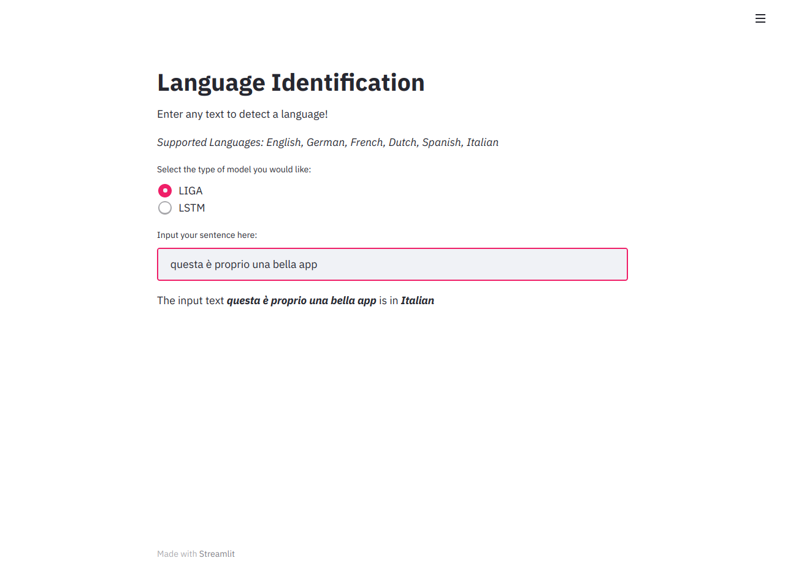
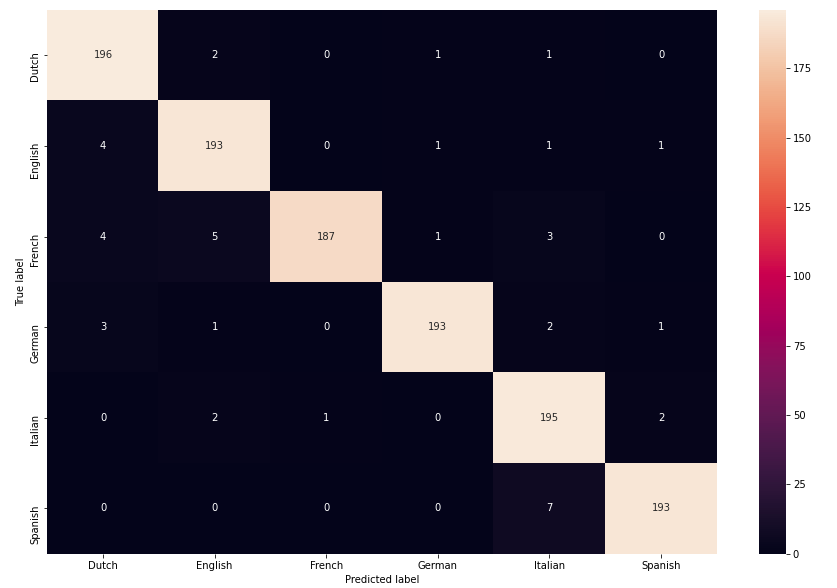
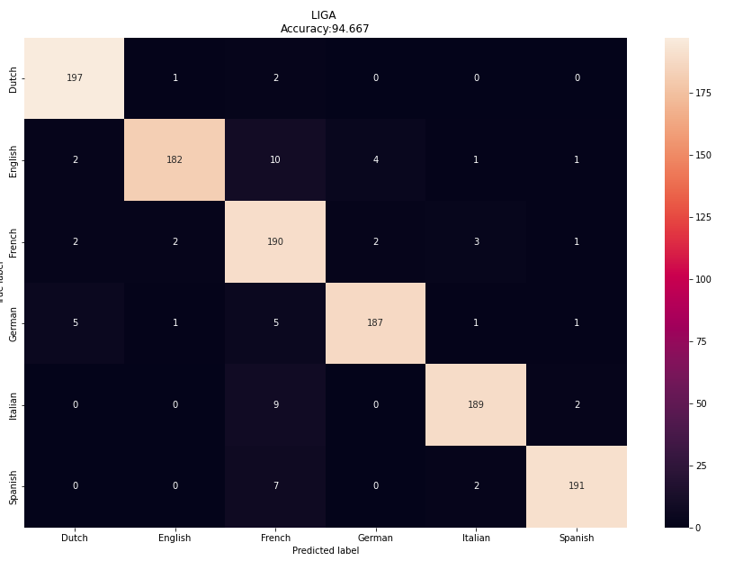

<h1 align = 'center'> Language Identification</h1>

<br>


<div align="center">

[]("Python3")
[]("Streamlit")


</div>


<h2>Overview</h2>
<p>
A web app, created using Streamlit, for the task of language identification implemented using two different algorithms, 
one using a graph based n-gram approach,and the other, a character level lstm model. 
Languages identified: <b> English, German, French, Dutch, Spanish, Italian </b>
</p>

------------------------------------------

<div align="center">
<h3 align="center"> Web app</h3>
<p align="center"> 

</p>
</div>

------------------------------------------

<h2>Dataset</h2>

<p>Dataset used for this task was: http://www.win.tue.nl/~mpechen/projects/smm/.
A total of 7200 (1200 for each class) samples were used for training and 1200 (200 for each class) for testing
</p>

-----------------------------------------

<h2>Algorithms</h2>

### a) LIGA: 
<ul>
<li> An n-gram approach where n-grams (here, n=3) are nodes of a directed graph.
<li> Each vertex captures the frequency of the tri-gram for all langauges.
<li> Each edge captures the tri-gram order for all languages and assigns it a weight depending on the frequency.
<li> At inference time, text is broken into same order n-grams as the trained graph, and scores for the edges and vertices are added to the respective language score.
<li> The scores are normalized, each being in a range of [0,2] (Since, both edge and vertex scores are added, max score is 2).
<li> Language with the maximum score is the correct language for the text.
<li> Acheived an accuracy of 94 % on the test dataset.
</ul>

### b) LSTM:
<ul>
<li> A character level Bi-lstm implemented in PyTorch, for sequences of 90 characters.
<li> An embedding size of 300 is used for the characters, with their being 61 total characters in our vocabulary.
<li> For cross validation, a 5 fold cross validation technique was used, with the accuracy for testing being 96 %. 
</ul>
------------------------------------------
<h2>Results</h2>

<div align="center">
<h3 align="center"> LSTM</h3>
<p align="center"> 

</p>
</div>


<div align="center">
<h3 align="center"> LIGA</h3>
<p align="center"> 

</p>
</div>

------------------------------------------
<h2>Installation</h2>


A step by step series of examples that tell you how to get the app running.
In your cmd:

```
git clone https://github.com/talha1503/Language-Identification.git
```

Then,

```
cd Language-Identification
pip install -r requirements.txt
streamlit run main.py
```

